Universidade Federal de Santa Catarina

Construção de Compiladores

Alunos: - Gabriel Luz, José Victor Feijó, André Pereira


## Pandora Lang

Escolhemos a linguagem de programação Lua como base da definição de nossa gramática por se tratar de uma linguagem simples e moderna, e também foi desenvolvida no Brasil na PUC-RJ

Fizemos algumas mudanças na linguagem para simplificar e também deixar ela mais moderna.
As mudanças mais aparentes são as definições de variaveis agora é somente por def, definição de função é defn, inclusão de declaração arrow functions. Também removemos loops desnecessários para simplifcação da analise semantica. Agora, While é a única opção para loop da linguagem. Uma troca simples foi a troca sintática de como fazer  comentarios. Originalmente o comentário de linha é --, foi trocado para os padrões definidos em C // para comentario em linha e /* */ para comentarios multi-linha

### Comentários

```c
// Comentários são iguais ao do C e java

/* Blocos de comentários
 * também seguem os mesmo modelo
 */
```

### Diagramas:

LINE_COMMENT


COMMENT


### Variáveis são definidas pela keyword 'def'

```elixir
def foo = 'String'
def foo, bar = 'String', 20
def somaMult = (20 + 20) * 2
```

### Diagramas:
stat

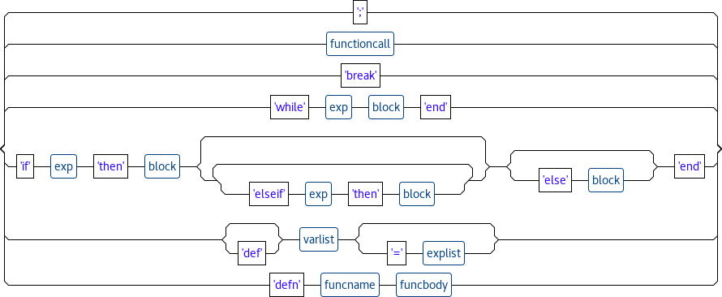

varlist


var


varSuffix

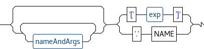

nameAndArgs


args

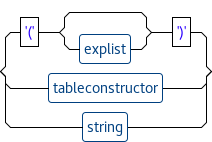

explist

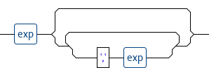

exp

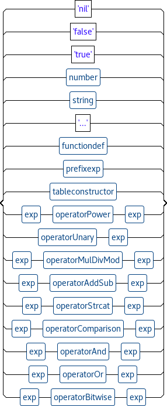

explist


Tokens:
```
[@0,0:2='def',<'def'>,1:0]
[@1,4:6='foo',<NAME>,1:4]
[@2,8:8='=',<'='>,1:8]
[@3,10:17=''String'',<CHARSTRING>,1:10]
[@4,19:21='def',<'def'>,2:0]
[@5,23:25='foo',<NAME>,2:4]
[@6,26:26=',',<','>,2:7]
[@7,28:30='bar',<NAME>,2:9]
[@8,32:32='=',<'='>,2:13]
[@9,34:41=''String'',<CHARSTRING>,2:15]
[@10,42:42=',',<','>,2:23]
[@11,44:45='20',<INT>,2:25]
[@12,47:49='def',<'def'>,3:0]
[@13,51:58='somaMult',<NAME>,3:4]
[@14,60:60='=',<'='>,3:13]
[@15,62:62='(',<'('>,3:15]
[@16,63:64='20',<INT>,3:16]
[@17,66:66='+',<'+'>,3:19]
[@18,68:69='20',<INT>,3:21]
[@19,70:70=')',<')'>,3:23]
[@20,72:72='*',<'*'>,3:25]
[@21,74:74='2',<INT>,3:27]
[@22,76:75='<EOF>',<EOF>,4:0]
```

### Funçôes podem ser definidas por defn

```elixir
defn sum(a, b)
  return a + b
end
```

### Diagrama do antlr4

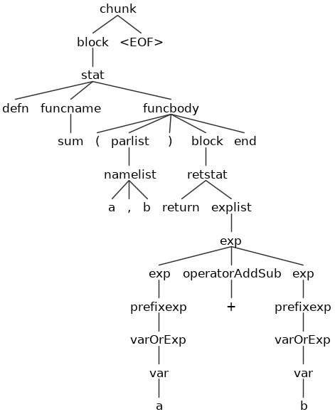

### Diagrama do railroad

funcname

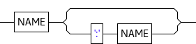

funcbody

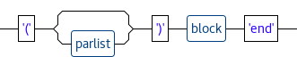

Tokens:
```
[@0,0:3='defn',<'defn'>,1:0]
[@1,5:7='sum',<NAME>,1:5]
[@2,8:8='(',<'('>,1:8]
[@3,9:9='a',<NAME>,1:9]
[@4,10:10=',',<','>,1:10]
[@5,12:12='b',<NAME>,1:12]
[@6,13:13=')',<')'>,1:13]
[@7,17:22='return',<'return'>,2:2]
[@8,24:24='a',<NAME>,2:9]
[@9,26:26='+',<'+'>,2:11]
[@10,28:28='b',<NAME>,2:13]
[@11,30:32='end',<'end'>,3:0]
[@12,34:33='<EOF>',<EOF>,4:0]
```

### Tambem pode ser definido por function e atribuido a uma variavel

```elixir
def new_sum = function(a, b)
  return a + b
end
```

Tokens:
```
[@0,0:2='def',<'def'>,1:0]
[@1,4:10='new_sum',<NAME>,1:4]
[@2,12:12='=',<'='>,1:12]
[@3,14:21='function',<'function'>,1:14]
[@4,22:22='(',<'('>,1:22]
[@5,23:23='a',<NAME>,1:23]
[@6,24:24=',',<','>,1:24]
[@7,26:26='b',<NAME>,1:26]
[@8,27:27=')',<')'>,1:27]
[@9,31:36='return',<'return'>,2:2]
[@10,38:38='a',<NAME>,2:9]
[@11,40:40='+',<'+'>,2:11]
[@12,42:42='b',<NAME>,2:13]
[@13,44:46='end',<'end'>,3:0]
[@14,48:47='<EOF>',<EOF>,4:0]
```

### Novo modelo de declarar funcao com arrow function

```elixir
def sub = (a, b) => return a - b end
```

Tokens:
```
[@0,0:2='def',<'def'>,1:0]
[@1,4:6='sub',<NAME>,1:4]
[@2,8:8='=',<'='>,1:8]
[@3,10:10='(',<'('>,1:10]
[@4,11:11='a',<NAME>,1:11]
[@5,12:12=',',<','>,1:12]
[@6,14:14='b',<NAME>,1:14]
[@7,15:15=')',<')'>,1:15]
[@8,17:18='=>',<'=>'>,1:17]
[@9,20:25='return',<'return'>,1:20]
[@10,27:27='a',<NAME>,1:27]
[@11,29:29='-',<'-'>,1:29]
[@12,31:31='b',<NAME>,1:31]
[@13,33:35='end',<'end'>,1:33]
[@14,37:36='<EOF>',<EOF>,2:0]
```

### Diagrama da definição de função

functiondef

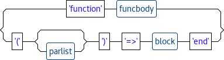


### Lexical Errors

```elixir
def &$#&&$#&$ = 0
```

Tokens:
```
line 1:5 token recognition error at: '$'
line 1:9 token recognition error at: '$'
line 1:12 token recognition error at: '$'
line 1:4 mismatched input '&' expecting NAME

```

### O 'Map' pode ser criado através da estrutura de dados Table:

```elixir
def person = {name: 'Jonas'; age: 19; gender: 'M'}
```

### Diagrama railroad

table

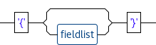

fieldlist

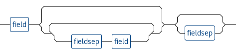

field

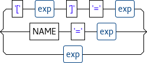

fieldsep


### Funções podem receber outras funções por parâmetros
```elixir
defn exec(func, a)
  return func(a)
end

def result = exec((a) => return a*a end, 10)
```

### Diagrama do antlr4:


## Programa Exemplo

```elixir
defn fibonacci(n)
  if n<3 then
    return 1
  else
    return fibonacci(n-1) + fibonacci(n-2)
  end
end

def count = 16
while (count > 0)
  print(fibonacci(count) ", ")
  count = count -1;
end
```
Tokens:
```
[@0,0:3='defn',<'defn'>,1:0]
[@1,5:13='fibonacci',<NAME>,1:5]
[@2,14:14='(',<'('>,1:14]
[@3,15:15='n',<NAME>,1:15]
[@4,16:16=')',<')'>,1:16]
[@5,20:21='if',<'if'>,2:2]
[@6,23:23='n',<NAME>,2:5]
[@7,24:24='<',<'<'>,2:6]
[@8,25:25='3',<INT>,2:7]
[@9,27:30='then',<'then'>,2:9]
[@10,36:41='return',<'return'>,3:4]
[@11,43:43='1',<INT>,3:11]
[@12,47:50='else',<'else'>,4:2]
[@13,56:61='return',<'return'>,5:4]
[@14,63:71='fibonacci',<NAME>,5:11]
[@15,72:72='(',<'('>,5:20]
[@16,73:73='n',<NAME>,5:21]
[@17,74:74='-',<'-'>,5:22]
[@18,75:75='1',<INT>,5:23]
[@19,76:76=')',<')'>,5:24]
[@20,78:78='+',<'+'>,5:26]
[@21,80:88='fibonacci',<NAME>,5:28]
[@22,89:89='(',<'('>,5:37]
[@23,90:90='n',<NAME>,5:38]
[@24,91:91='-',<'-'>,5:39]
[@25,92:92='2',<INT>,5:40]
[@26,93:93=')',<')'>,5:41]
[@27,97:99='end',<'end'>,6:2]
[@28,101:103='end',<'end'>,7:0]
[@29,106:108='def',<'def'>,9:0]
[@30,110:114='count',<NAME>,9:4]
[@31,116:116='=',<'='>,9:10]
[@32,118:119='16',<INT>,9:12]
[@33,121:125='while',<'while'>,10:0]
[@34,127:127='(',<'('>,10:6]
[@35,128:132='count',<NAME>,10:7]
[@36,134:134='>',<'>'>,10:13]
[@37,136:136='0',<INT>,10:15]
[@38,137:137=')',<')'>,10:16]
[@39,141:145='print',<NAME>,11:2]
[@40,146:146='(',<'('>,11:7]
[@41,147:155='fibonacci',<NAME>,11:8]
[@42,156:156='(',<'('>,11:17]
[@43,157:161='count',<NAME>,11:18]
[@44,162:162=')',<')'>,11:23]
[@45,164:167='", "',<NORMALSTRING>,11:25]
[@46,168:168=')',<')'>,11:29]
[@47,172:176='count',<NAME>,12:2]
[@48,178:178='=',<'='>,12:8]
[@49,180:184='count',<NAME>,12:10]
[@50,186:186='-',<'-'>,12:16]
[@51,187:187='1',<INT>,12:17]
[@52,188:188=';',<';'>,12:18]
[@53,190:192='end',<'end'>,13:0]
[@54,194:193='<EOF>',<EOF>,14:0]
```
Diagrama do antlr4:
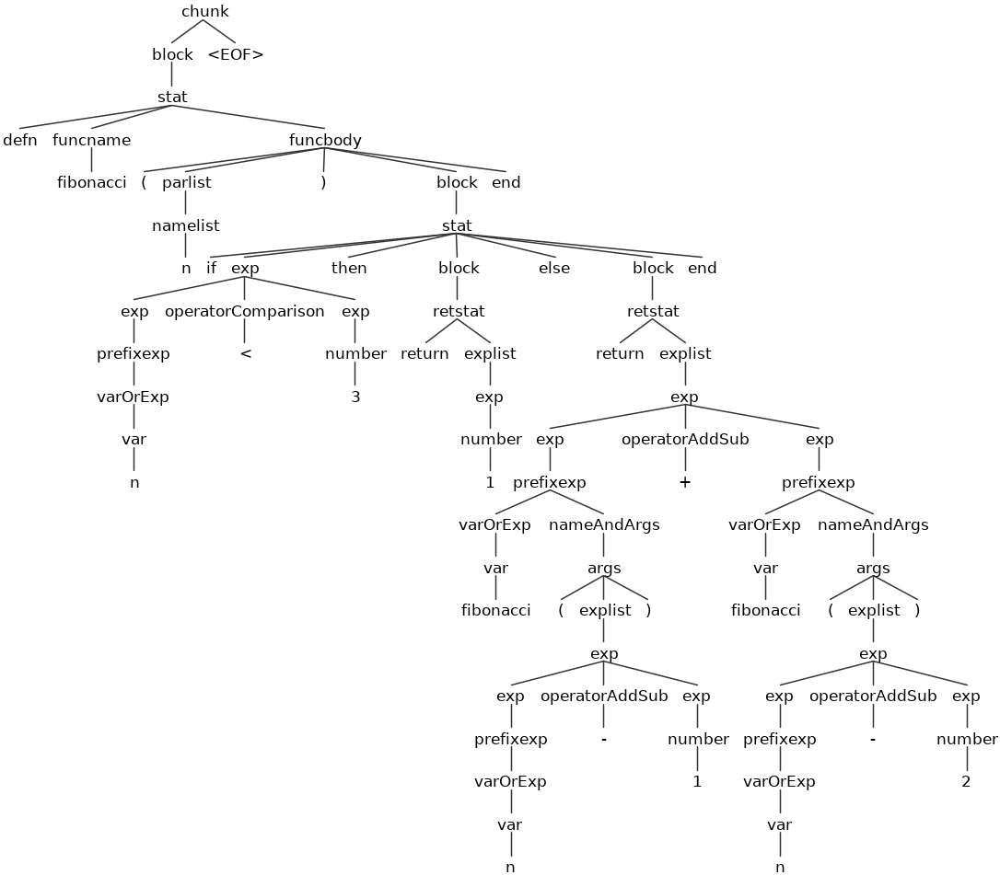


## EBNF da linguagem Pandora (antlr4):

```
grammar Pandora;

chunk
    : block EOF
    ;

block
    : stat* retstat?
    ;

stat
    : ';'
    | functioncall
    | 'break'
    | 'while' exp block 'end'
    | 'if' exp 'then' block ('elseif' exp 'then' block)* ('else' block)? 'end'
    | 'def'? varlist ('=' explist)?
    | 'defn' funcname funcbody
    ;

retstat
    : 'return' explist? ';'?
    ;

funcname
    : NAME (':' NAME)?
    ;

varlist
    : var (',' var)*
    ;

namelist
    : NAME (',' NAME)*
    ;

explist
    : exp (',' exp)*
    ;

exp
    : 'nil' | 'false' | 'true'
    | number
    | string
    | '...'
    | functiondef
    | prefixexp
    | tableconstructor
    | <assoc=right> exp operatorPower exp
    | operatorUnary exp
    | exp operatorMulDivMod exp
    | exp operatorAddSub exp
    | <assoc=right> exp operatorStrcat exp
    | exp operatorComparison exp
    | exp operatorAnd exp
    | exp operatorOr exp
    | exp operatorBitwise exp
    ;

prefixexp
    : varOrExp nameAndArgs*
    ;

functioncall
    : varOrExp nameAndArgs+
    ;

varOrExp
    : var | '(' exp ')'
    ;

var
    : NAME varSuffix*
    ;

varSuffix
    : nameAndArgs* ('[' exp ']' | '.' NAME)
    ;

nameAndArgs
    : (':' NAME)? args
    ;

args
    : '(' explist? ')' | tableconstructor | string
    ;

functiondef
    : 'function' funcbody
    | '(' parlist? ')' '=>' block 'end'
    ;

funcbody
    : '(' parlist? ')' block 'end'
    ;

parlist
    : namelist (',' '...')? | '...'
    ;

tableconstructor
    : '{' fieldlist? '}'
    ;

fieldlist
    : field (fieldsep field)* fieldsep?
    ;

field
    : '[' exp ']' '=' exp | NAME '=' exp | exp
    ;

fieldsep
    : ',' | ';'
    ;

operatorOr
  : 'or';

operatorAnd
  : 'and';

operatorComparison
  : '<' | '>' | '<=' | '>=' | '~=' | '==';

operatorStrcat
  : '..';

operatorAddSub
  : '+' | '-';

operatorMulDivMod
  : '*' | '/' | '%';

operatorBitwise
  : '&' | '|' | '~' | '<<' | '>>';

operatorUnary
    : 'not' | '#' | '-' | '~';

operatorPower
    : '^';

number
    : INT | HEX | FLOAT | HEX_FLOAT
    ;

string
    : NORMALSTRING | CHARSTRING | LONGSTRING
    ;

// LEXER

NAME
    : [a-zA-Z_][a-zA-Z_0-9]*
    ;

NORMALSTRING
    : '"' ( EscapeSequence | ~('\\'|'"') )* '"'
    ;

CHARSTRING
    : '\'' ( EscapeSequence | ~('\''|'\\') )* '\''
    ;

LONGSTRING
    : '[' NESTED_STR ']'
    ;

fragment
NESTED_STR
    : '=' NESTED_STR '='
    | '[' .*? ']'
    ;

INT
    : Digit+
    ;

HEX
    : '0' [xX] HexDigit+
    ;

FLOAT
    : Digit+ '.' Digit* ExponentPart?
    | '.' Digit+ ExponentPart?
    | Digit+ ExponentPart
    ;

HEX_FLOAT
    : '0' [xX] HexDigit+ '.' HexDigit* HexExponentPart?
    | '0' [xX] '.' HexDigit+ HexExponentPart?
    | '0' [xX] HexDigit+ HexExponentPart
    ;

fragment
ExponentPart
    : [eE] [+-]? Digit+
    ;

fragment
HexExponentPart
    : [pP] [+-]? Digit+
    ;

fragment
EscapeSequence
    : '\\' [abfnrtvz"'\\]
    | '\\' '\r'? '\n'
    | DecimalEscape
    | HexEscape
    | UtfEscape
    ;

fragment
DecimalEscape
    : '\\' Digit
    | '\\' Digit Digit
    | '\\' [0-2] Digit Digit
    ;

fragment
HexEscape
    : '\\' 'x' HexDigit HexDigit
    ;

fragment
UtfEscape
    : '\\' 'u{' HexDigit+ '}'
    ;

fragment
Digit
    : [0-9]
    ;

fragment
HexDigit
    : [0-9a-fA-F]
    ;

COMMENT
    : '/*' .*? '*/' -> skip
    ;

LINE_COMMENT
    : '//' ~[\r\n]* -> skip
    ;

WS
    : [ \t\u000C\r\n]+ -> skip
    ;

SHEBANG
    : '#' '!' ~('\n'|'\r')* -> channel(HIDDEN)
    ;
```
